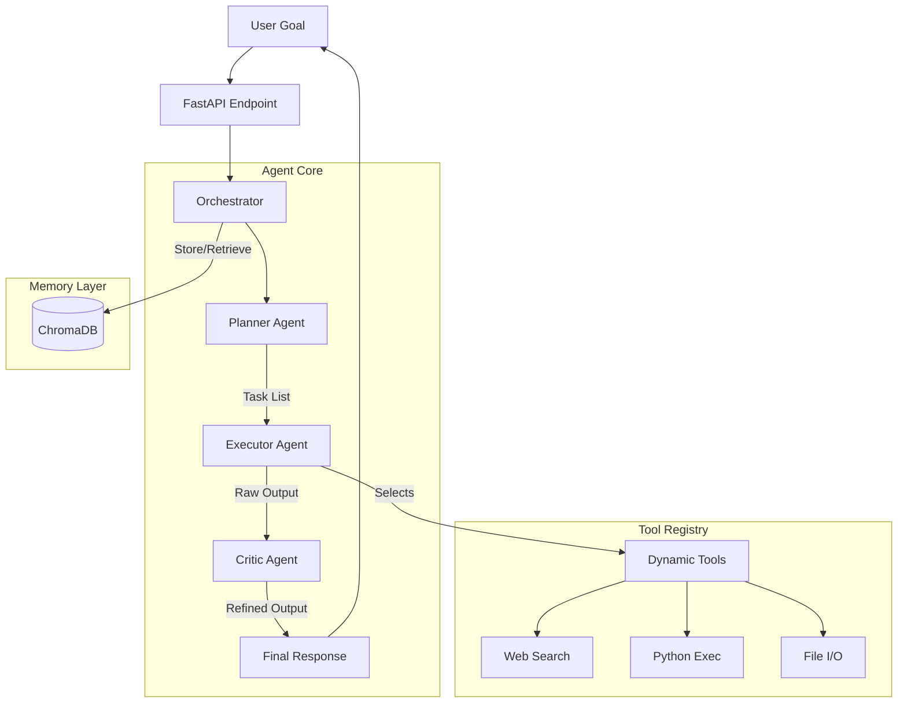

# 🧠 NeuroOps: Autonomous AI Task Execution System


**NeuroOps** is a production-grade, multi-agent orchestration framework designed to transform high-level natural language goals into executed actions. Unlike simple chatbots, NeuroOps employs a cyclic reasoning architecture involving **Planning**, **Tool Execution**, **Reflection**, and **Long-Term Memory**.

Built with **FastAPI**, **Ollama (Qwen)**, and **ChromaDB**, it provides a scalable backend for autonomous agents capable of web research, file manipulation, code execution, and self-correction.

---

## 🌟 Key Features

- ** Multi-Agent Architecture**: Distinct roles for Planning, Execution, and Critiquing ensure high-quality outputs.
- **🛠 Dynamic Tool Selection**: An intelligent router decides whether to use LLM reasoning or specific tools (Web Search, Python Interpreter, File I/O) per task.
- **♻️ Self-Reflection Loop**: A dedicated "Critic" agent reviews outputs against original goals to improve accuracy and completeness before final delivery.
- **💾 Persistent Memory**: Integrated ChromaDB vector store allows the system to retain context and learn from past executions across sessions.
- ** Production Ready**: Built on FastAPI with type safety, error handling, retry mechanisms, and modular design patterns.
- **🔒 Safe Execution**: Sandboxed Python execution and controlled file access prevent unintended system modifications.

---

## 🏗 System Architecture




### Core Components
1.  **Planner**: Decomposes abstract goals into sequential, actionable JSON tasks.
2.  **Executor**: Analyzes each task to select the optimal tool or fallback to direct LLM generation.
3.  **Critic**: Evaluates aggregated results for coherence, accuracy, and goal alignment.
4.  **Memory**: Stores execution logs and insights for future retrieval via semantic search.

---

## 🚀 Quick Start

### Prerequisites
- **Python 3.9+**
- **Ollama**: [Install Ollama](https://ollama.com)
- **Model**: Ensure `qwen2.5:latest` is pulled (or configure custom model in `.env`).

### Installation

1.  **Clone the Repository**
    ```bash
    git clone https://github.com/ArhaanDev24/neuroops.git
    cd neuroops
    ```

2.  **Setup Virtual Environment**
    ```bash
    # Create venv
    python3 -m venv venv

    # Activate
    source venv/bin/activate  # Mac/Linux
    # OR
    .\venv\Scripts\Activate.ps1 # Windows
    ```

3.  **Install Dependencies**
    ```bash
    pip install --upgrade pip
    pip install -r requirements.txt
    ```

4.  **Initialize Ollama Model**
    ```bash
    ollama pull qwen2.5:latest
    ```

### Running the System

#### Option A: Start the API Server
```bash
python -m backend.main
```
*Server runs at `http://localhost:8000`. Interactive docs available at `/docs`.*

#### Option B: Run the CLI Interface
```bash
python cli.py
```

---

## 📡 API Documentation

### Endpoints

#### `POST /execute-goal`
Executes a high-level goal through the full agent pipeline.

**Request Body:**
```json
{
  "goal": "Research current stock prices for AAPL and save the summary to 'report.txt'"
}
```

**Response Schema:**
```json
{
  "goal": "string",
  "plan": ["step 1", "step 2"],
  "execution": [
    {
      "task": "string",
      "tool_used": "web_search",
      "result": "string"
    }
  ],
  "final_output": "string",
  "duration_seconds": 12.5
}
```

#### `GET /health`
Checks system status.
```json
{ "status": "healthy", "service": "NeuroOps" }
```

---

## 🛠 Extending NeuroOps

### Adding a New Tool
1.  Create a new file in `backend/tools/` (e.g., `weather_tool.py`).
2.  Define your function with clear input/output types.
3.  Register the tool in `backend/tools/__init__.py`:
    ```python
    TOOL_REGISTRY = {
        ...
        "get_weather": {
            "func": get_weather,
            "description": "Fetches weather for a city.",
            "args": ["city"]
        }
    }
    ```
The Executor agent will automatically detect and utilize the new tool based on task requirements.

### Customizing the LLM
Edit `backend/llm.py` to change the model or endpoint:
```python
MODEL_NAME = os.getenv("MODEL_NAME", "llama3:latest") # Change model here
OLLAMA_URL = os.getenv("OLLAMA_URL", "http://localhost:11434")
```

---

## 📂 Project Structure

```text
neuroops/
├── backend/
│   ├── main.py                # FastAPI entry point
│   ├── orchestrator.py        # Core workflow logic
│   ├── llm.py                 # Ollama wrapper & retry logic
│   ├── agents/                # Planner, Executor, Critic
│   ├── tools/                 # Modular tool implementations
│   └── memory/                # ChromaDB integration
── cli.py                     # Command-line interface
├── requirements.txt           # Python dependencies
── README.md
```

---

## ⚙️ Configuration

| Variable | Description | Default |
|----------|-------------|---------|
| `OLLAMA_URL` | URL of the Ollama instance | `http://localhost:11434` |
| `MODEL_NAME` | LLM model tag to use | `qwen2.5:latest` |
| `CHROMA_PATH` | Directory for vector DB persistence | `./chroma_db` |

---

## 🤝 Contributing

Contributions are welcome! Please follow these steps:
1.  Fork the repository.
2.  Create a feature branch (`git checkout -b feature/amazing-tool`).
3.  Commit your changes (`git commit -m 'Add amazing tool'`).
4.  Push to the branch (`git push origin feature/amazing-tool`).
5.  Open a Pull Request.

---


## 📞 Support

For issues, feature requests, or questions, please open an issue on the GitHub repository.

*Built with ❤️ by the NeuroOps Team.*
```
